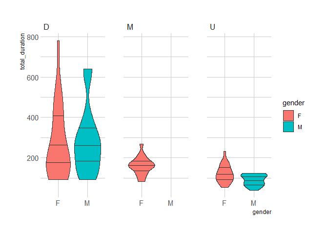
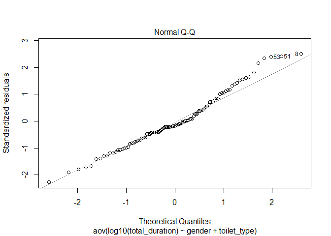
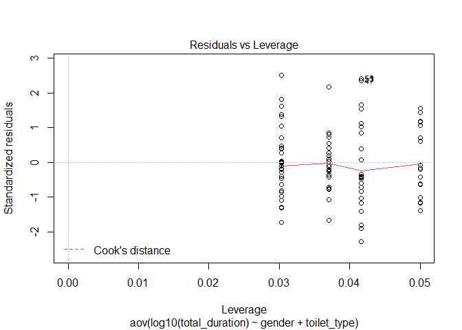

Untitled
================

## Import data

This is an R Markdown format used for publishing markdown documents to
GitHub. When you click the **Knit** button all R code chunks are run and
a markdown file (.md) suitable for publishing to GitHub is generated.

## Including Code

You can include R code in the document as follows:

``` r
df <- read.csv(file = "../data/toilet_duration.csv") %>% janitor::clean_names()
df
```

    ##     participant_id       start_time        stop_time duration mn_60 sec
    ## 1         WT_001_W 25/07/2022 15:16 25/07/2022 15:18   02: 18   120  18
    ## 2         WT_001_W 25/07/2022 15:20 25/07/2022 15:21   01: 48    60  48
    ## 3         WT_001_W 25/07/2022 15:23 25/07/2022 15:25   02: 37   120  37
    ## 4         WT_002_W 25/07/2022 15:37 25/07/2022 15:38   01: 03    60   3
    ## 5         WT_002_W 25/07/2022 15:39 25/07/2022 15:40   01: 32    60  32
    ## 6         WT_002_W 25/07/2022 15:46 25/07/2022 15:48   02: 00   120   0
    ## 7         WT_003_W 25/07/2022 16:11 25/07/2022 16:13   02: 45   120  45
    ## 8         WT_003_W 25/07/2022 16:16 25/07/2022 16:29   13: 00   780   0
    ## 9         WT_003_W 25/07/2022 16:37 25/07/2022 16:40   03: 00   180   0
    ## 10        WT_004_W 26/07/2022 11:49 26/07/2022 11:50   01: 21    60  21
    ## 11        WT_004_W 26/07/2022 11:52 26/07/2022 11:54   02: 13   120  13
    ## 12        WT_004_W 26/07/2022 11:56 26/07/2022 11:58   02: 28   120  28
    ## 13        WT_005_W 26/07/2022 12:27 26/07/2022 12:29   02: 54   120  54
    ## 14        WT_005_W 26/07/2022 12:30 26/07/2022 12:37   07: 38   420  38
    ## 15        WT_005_W 26/07/2022 12:40 26/07/2022 12:41   01: 22    60  22
    ## 16        WT_006_W 26/07/2022 12:53 26/07/2022 12:54   01: 39    60  39
    ## 17        WT_006_W 26/07/2022 12:56 26/07/2022 12:59   03: 43   180  43
    ## 18        WT_006_W 26/07/2022 13:01 26/07/2022 13:03   02: 37   120  37
    ## 19        WT_007_W 26/07/2022 14:28 26/07/2022 14:31   03: 53   180  53
    ## 20        WT_007_W 26/07/2022 14:32 26/07/2022 14:37   05: 27   300  27
    ## 21        WT_007_W 26/07/2022 14:39 26/07/2022 14:43   04: 28   240  28
    ## 22        WT_008_W 26/07/2022 14:51 26/07/2022 14:53   02: 58   120  58
    ## 23        WT_008_W 26/07/2022 14:55 26/07/2022 15:01   06: 37   360  37
    ## 24        WT_008_W 26/07/2022 15:04 26/07/2022 15:06   02: 56   120  56
    ## 25        WT_009_W 26/07/2022 15:43 26/07/2022 15:44   01: 38    60  38
    ## 26        WT_009_W 26/07/2022 15:46 26/07/2022 15:49   03: 41   180  41
    ## 27        WT_009_W 26/07/2022 15:52 26/07/2022 15:54   02: 54   120  54
    ## 28        WT_010_W 26/07/2022 16:13 26/07/2022 16:14   01: 46    60  46
    ## 29        WT_010_W 26/07/2022 16:16 26/07/2022 16:22   06: 25   360  25
    ## 30        WT_010_W 26/07/2022 16:25 26/07/2022 16:27   02: 35   120  35
    ## 31        WT_011_W 28/07/2022 12:52 28/07/2022 12:54   02: 13   120  13
    ## 32        WT_011_W 28/07/2022 12:56 28/07/2022 13:04   08: 35   480  35
    ## 33        WT_011_W 28/07/2022 13:06 28/07/2022 13:09   03: 26   180  26
    ## 34        MT_001_M 27/07/2022 10:37 27/07/2022 10:37   00: 53     0  53
    ## 35        MT_001_M 27/07/2022 10:41 27/07/2022 10:43   02: 40   120  40
    ## 36        MT_002_M 27/07/2022 11:09 27/07/2022 11:10   01: 17    60  17
    ## 37        MT_002_M 27/07/2022 11:12 27/07/2022 11:18   06: 49   360  49
    ## 38        MT_003_M 27/07/2022 11:24 27/07/2022 11:24   00: 50     0  50
    ## 39        MT_003_M 27/07/2022 11:29 27/07/2022 11:32   03: 13   180  13
    ## 40        MT_004_M 27/07/2022 11:40 27/07/2022 11:41   01: 23    60  23
    ## 41        MT_004_M 27/07/2022 11:43 27/07/2022 11:47   04: 59   240  59
    ## 42        MT_005_M 27/07/2022 11:59 27/07/2022 12:00   01: 59    60  59
    ## 43        MT_005_M 27/07/2022 12:01 27/07/2022 12:02   01: 48    60  48
    ## 44        MT_006_M 27/07/2022 12:09 27/07/2022 12:11   02: 01   120   1
    ## 45        MT_006_M 27/07/2022 12:14 27/07/2022 12:20   06: 19   360  19
    ## 46        MT_007_M 27/07/2022 13:56 27/07/2022 13:57   01: 34    60  34
    ## 47        MT_007_M 27/07/2022 13:59 27/07/2022 14:09   10: 13   600  13
    ## 48        MT_008_M 27/07/2022 14:29 27/07/2022 14:30   01: 56    60  56
    ## 49        MT_008_M 27/07/2022 14:31 27/07/2022 14:33   02: 06   120   6
    ## 50        MT_009_M 27/07/2022 15:06 27/07/2022 15:06   00: 40     0  40
    ## 51        MT_009_M 27/07/2022 15:08 27/07/2022 15:18   10: 40   600  40
    ## 52        MT_010_M 27/07/2022 15:28 27/07/2022 15:29   01: 41    60  41
    ## 53        MT_010_M 27/07/2022 15:33 27/07/2022 15:43   10: 36   600  36
    ## 54        MT_011_M 28/07/2022 12:06 28/07/2022 12:08   02: 00   120   0
    ## 55        MT_011_M 28/07/2022 12:10 28/07/2022 12:14   04: 40   240  40
    ## 56        MT_011_M 28/07/2022 12:19 28/07/2022 12:20   01: 07    60   7
    ## 57        MT_011_M 28/07/2022 12:21 28/07/2022 12:25   04: 14   240  14
    ## 58        GT_012_W 29/07/2022 10:37 29/07/2022 10:39   02: 46   120  46
    ## 59        GT_012_W 29/07/2022 10:40 29/07/2022 10:42   02: 15   120  15
    ## 60        GT_012_W 29/07/2022 10:44 29/07/2022 10:47   03: 01   180   1
    ## 61        GT_013_M 29/07/2022 11:11 29/07/2022 11:12   01: 35    60  35
    ## 62        GT_013_M 29/07/2022 11:14 29/07/2022 11:19   05: 40   300  40
    ## 63        GT_014_W 29/07/2022 11:22 29/07/2022 11:24   02: 12   120  12
    ## 64        GT_014_W 29/07/2022 11:26 29/07/2022 11:34   08: 32   480  32
    ## 65        GT_014_W 29/07/2022 11:36 29/07/2022 11:38   02: 05   120   5
    ## 66        GT_015_W 29/07/2022 11:50 29/07/2022 11:51   01: 50    60  50
    ## 67        GT_015_W 29/07/2022 11:53 29/07/2022 11:55   02: 29   120  29
    ## 68        GT_015_W 29/07/2022 11:57 29/07/2022 11:59   02: 46   120  46
    ## 69        GT_016_W 29/07/2022 12:05 29/07/2022 12:06   01: 15    60  15
    ## 70        GT_016_W 29/07/2022 12:08 29/07/2022 12:10   02: 04   120   4
    ## 71        GT_016_W 29/07/2022 12:11 29/07/2022 12:12   01: 31    60  31
    ## 72        GT_017_W 29/07/2022 13:54 29/07/2022 13:55   01: 33    60  33
    ## 73        GT_017_W 29/07/2022 13:57 29/07/2022 13:59   02: 05   120   5
    ## 74        GT_017_W 29/07/2022 14:00 29/07/2022 14:02   02: 38   120  38
    ## 75        GT_018_W 29/07/2022 14:04 29/07/2022 14:04   00: 53     0  53
    ## 76        GT_018_W 29/07/2022 14:06 29/07/2022 14:09   03: 54   180  54
    ## 77        GT_018_W 29/07/2022 14:10 29/07/2022 14:12   01: 54    60  54
    ## 78        GT_019_M 29/07/2022 14:14 29/07/2022 14:15   01: 09    60   9
    ## 79        GT_019_M 29/07/2022 14:16 29/07/2022 14:17   01: 33    60  33
    ## 80        GT_020_M 29/07/2022 15:14 29/07/2022 15:15   01: 46    60  46
    ## 81        GT_020_M 29/07/2022 15:17 29/07/2022 15:21   04: 28   240  28
    ## 82        GT_021_M 29/07/2022 15:24 29/07/2022 15:25   01: 00    60   0
    ## 83        GT_021_M 29/07/2022 15:26 29/07/2022 15:29   03: 15   180  15
    ## 84        GT_022_M 29/07/2022 15:56 29/07/2022 15:58   02: 00   120   0
    ## 85        GT_022_M 29/07/2022 15:59 29/07/2022 16:03   04: 15   240  15
    ## 86        GT_023_W 29/07/2022 16:26 29/07/2022 16:27   01: 30    60  30
    ## 87        GT_023_W 29/07/2022 16:29 29/07/2022 16:31   02: 30   120  30
    ## 88        GT_023_W 29/07/2022 16:34 29/07/2022 16:36   02: 24   120  24
    ## 89        GT_024_M 01/08/2022 11:04 01/08/2022 11:05   01: 46    60  46
    ## 90        GT_024_M 01/08/2022 11:07 01/08/2022 11:10   03: 26   180  26
    ## 91        GT_025_W 01/08/2022 11:50 01/08/2022 11:52   02: 02   120   2
    ## 92        GT_025_W 01/08/2022 11:54 01/08/2022 11:57   03: 48   180  48
    ## 93        GT_025_W 01/08/2022 11:59 01/08/2022 12:02   03: 39   180  39
    ## 94        GT_026_W 01/08/2022 12:04 01/08/2022 12:06   02: 11   120  11
    ## 95        GT_026_W 01/08/2022 12:07 01/08/2022 12:10   03: 17   180  17
    ## 96        GT_026_W 01/08/2022 12:12 01/08/2022 12:15   03: 15   180  15
    ## 97        GT_027_M 01/08/2022 12:43 01/08/2022 12:44   01: 15    60  15
    ## 98        GT_027_M 01/08/2022 12:45 01/08/2022 12:47   02: 01   120   1
    ## 99        GT_028_M 01/08/2022 14:03 01/08/2022 14:05   02: 03   120   3
    ## 100       GT_028_M 01/08/2022 14:06 01/08/2022 14:11   05: 16   300  16
    ## 101       GT_029_M 01/08/2022 15:08 01/08/2022 15:10   02: 00   120   0
    ## 102       GT_029_M 01/08/2022 15:11 01/08/2022 15:15   04: 32   240  32
    ## 103       GT_030_M 01/08/2022 15:33 01/08/2022 15:34   01: 08    60   8
    ## 104       GT_030_M 01/08/2022 15:35 01/08/2022 15:37   02: 09   120   9
    ##     total_duration gender toilet_type activity
    ## 1              138      F           W        U
    ## 2              108      F           W        D
    ## 3              157      F           W        M
    ## 4               63      F           W        U
    ## 5               92      F           W        D
    ## 6              120      F           W        M
    ## 7              165      F           W        U
    ## 8              780      F           W        D
    ## 9              180      F           W        M
    ## 10              81      F           W        U
    ## 11             133      F           W        D
    ## 12             148      F           W        M
    ## 13             174      F           W        U
    ## 14             458      F           W        D
    ## 15              82      F           W        M
    ## 16              99      F           W        U
    ## 17             223      F           W        D
    ## 18             157      F           W        M
    ## 19             233      F           W        U
    ## 20             327      F           W        D
    ## 21             268      F           W        M
    ## 22             178      F           W        U
    ## 23             397      F           W        D
    ## 24             176      F           W        M
    ## 25              98      F           W        U
    ## 26             221      F           W        D
    ## 27             174      F           W        M
    ## 28             106      F           W        U
    ## 29             385      F           W        D
    ## 30             155      F           W        M
    ## 31             133      F           W        U
    ## 32             515      F           W        D
    ## 33             206      F           W        M
    ## 34              53      M           M        U
    ## 35             160      M           M        D
    ## 36              77      M           M        U
    ## 37             409      M           M        D
    ## 38              50      M           M        U
    ## 39             193      M           M        D
    ## 40              83      M           M        U
    ## 41             299      M           M        D
    ## 42             119      M           M        U
    ## 43             108      M           M        D
    ## 44             121      M           M        U
    ## 45             379      M           M        D
    ## 46              94      M           M        U
    ## 47             613      M           M        D
    ## 48             116      M           M        U
    ## 49             126      M           M        D
    ## 50              40      M           M        U
    ## 51             640      M           M        D
    ## 52             101      M           M        U
    ## 53             636      M           M        D
    ## 54             120      M           M        U
    ## 55             280      M           M        D
    ## 56              67      M           M        U
    ## 57             254      M           M        D
    ## 58             166      F          GN        U
    ## 59             135      F          GN        D
    ## 60             181      F          GN        M
    ## 61              95      M          GN        U
    ## 62             340      M          GN        D
    ## 63             132      F          GN        U
    ## 64             512      F          GN        D
    ## 65             125      F          GN        M
    ## 66             110      F          GN        U
    ## 67             149      F          GN        D
    ## 68             166      F          GN        M
    ## 69              75      F          GN        U
    ## 70             124      F          GN        D
    ## 71              91      F          GN        M
    ## 72              93      F          GN        U
    ## 73             125      F          GN        D
    ## 74             158      F          GN        M
    ## 75              53      F          GN        U
    ## 76             234      F          GN        D
    ## 77             114      F          GN        M
    ## 78              69      M          GN        U
    ## 79              93      M          GN        D
    ## 80             106      M          GN        U
    ## 81             268      M          GN        D
    ## 82              60      M          GN        U
    ## 83             195      M          GN        D
    ## 84             120      M          GN        U
    ## 85             255      M          GN        D
    ## 86              90      F          GN        U
    ## 87             150      F          GN        D
    ## 88             144      F          GN        M
    ## 89             106      M          GN        U
    ## 90             206      M          GN        D
    ## 91             122      F          GN        U
    ## 92             228      F          GN        D
    ## 93             219      F          GN        M
    ## 94             131      F          GN        U
    ## 95             197      F          GN        D
    ## 96             195      F          GN        M
    ## 97              75      M          GN        U
    ## 98             121      M          GN        D
    ## 99             123      M          GN        U
    ## 100            316      M          GN        D
    ## 101            120      M          GN        U
    ## 102            272      M          GN        D
    ## 103             68      M          GN        U
    ## 104            129      M          GN        D

``` r
df <- df  %>% 
  mutate(experimentID=row_number()) %>% 
  mutate(id=paste(experimentID,participant_id)) %>% 
  group_by(id) %>% 
  mutate(experimentID = paste0(stri_rand_strings(1, 5, "[A-Z]"), stri_rand_strings(1, 4, "[0-9]"), stri_rand_strings(1, 1, "[A-Z]")))
  
 head(df) 
```

    ## # A tibble: 6 x 12
    ## # Groups:   id [6]
    ##   participa~1 start~2 stop_~3 durat~4 mn_60   sec total~5 gender toile~6 activ~7
    ##   <chr>       <chr>   <chr>   <chr>   <int> <int>   <int> <chr>  <chr>   <chr>  
    ## 1 WT_001_W    25/07/~ 25/07/~ 02: 18    120    18     138 F      W       U      
    ## 2 WT_001_W    25/07/~ 25/07/~ 01: 48     60    48     108 F      W       D      
    ## 3 WT_001_W    25/07/~ 25/07/~ 02: 37    120    37     157 F      W       M      
    ## 4 WT_002_W    25/07/~ 25/07/~ 01: 03     60     3      63 F      W       U      
    ## 5 WT_002_W    25/07/~ 25/07/~ 01: 32     60    32      92 F      W       D      
    ## 6 WT_002_W    25/07/~ 25/07/~ 02: 00    120     0     120 F      W       M      
    ## # ... with 2 more variables: experimentID <chr>, id <chr>, and abbreviated
    ## #   variable names 1: participant_id, 2: start_time, 3: stop_time, 4: duration,
    ## #   5: total_duration, 6: toilet_type, 7: activity

# 1.1 Summary table

# Hyptheses

## Hypothesis 1

1)An increase in the length of time spent in shared toilet setting 2)
increases the level of indoor CO2 from exhaled air 3) which increases
the exposure and susceptibility to indoor airborne infection 4) when two
or more individuals share a toilet setting

``` r
#cleaning data
df %>% 
mutate ()
```

    ## # A tibble: 104 x 12
    ## # Groups:   id [104]
    ##    particip~1 start~2 stop_~3 durat~4 mn_60   sec total~5 gender toile~6 activ~7
    ##    <chr>      <chr>   <chr>   <chr>   <int> <int>   <int> <chr>  <chr>   <chr>  
    ##  1 WT_001_W   25/07/~ 25/07/~ 02: 18    120    18     138 F      W       U      
    ##  2 WT_001_W   25/07/~ 25/07/~ 01: 48     60    48     108 F      W       D      
    ##  3 WT_001_W   25/07/~ 25/07/~ 02: 37    120    37     157 F      W       M      
    ##  4 WT_002_W   25/07/~ 25/07/~ 01: 03     60     3      63 F      W       U      
    ##  5 WT_002_W   25/07/~ 25/07/~ 01: 32     60    32      92 F      W       D      
    ##  6 WT_002_W   25/07/~ 25/07/~ 02: 00    120     0     120 F      W       M      
    ##  7 WT_003_W   25/07/~ 25/07/~ 02: 45    120    45     165 F      W       U      
    ##  8 WT_003_W   25/07/~ 25/07/~ 13: 00    780     0     780 F      W       D      
    ##  9 WT_003_W   25/07/~ 25/07/~ 03: 00    180     0     180 F      W       M      
    ## 10 WT_004_W   26/07/~ 26/07/~ 01: 21     60    21      81 F      W       U      
    ## # ... with 94 more rows, 2 more variables: experimentID <chr>, id <chr>, and
    ## #   abbreviated variable names 1: participant_id, 2: start_time, 3: stop_time,
    ## #   4: duration, 5: total_duration, 6: toilet_type, 7: activity

``` r
df %>% ungroup() %>% 
  group_by(gender)%>% 
  summarise(Mean=mean(total_duration),
            SD=sd(total_duration,na.rm = TRUE))
```

    ## # A tibble: 2 x 3
    ##   gender  Mean    SD
    ##   <chr>  <dbl> <dbl>
    ## 1 F       186.  127.
    ## 2 M       188.  153.

``` r
df %>% ungroup() %>% 
  group_by(gender,toilet_type,activity)%>% 
  summarise(Mean=mean(total_duration),
            SD=sd(total_duration,na.rm = TRUE)) %>% arrange(Mean)
```

    ## `summarise()` has grouped output by 'gender', 'toilet_type'. You can override
    ## using the `.groups` argument.

    ## # A tibble: 10 x 5
    ## # Groups:   gender, toilet_type [4]
    ##    gender toilet_type activity  Mean    SD
    ##    <chr>  <chr>       <chr>    <dbl> <dbl>
    ##  1 M      M           U         86.8  29.5
    ##  2 M      GN          U         94.2  24.3
    ##  3 F      GN          U        108    34.2
    ##  4 F      W           U        133.   50.5
    ##  5 F      GN          M        155.   40.8
    ##  6 F      W           M        166.   47.1
    ##  7 F      GN          D        206   122. 
    ##  8 M      GN          D        220.   84.9
    ##  9 F      W           D        331.  207. 
    ## 10 M      M           D        341.  196.

# Mean in relation to gender and each activity

``` r
df %>% ungroup() %>% 
  group_by(gender,activity)%>% 
  summarise(Mean=mean(total_duration),
            SD=sd(total_duration,na.rm = TRUE)) %>% arrange(Mean) %>% ungroup() %>% add_row(gender="M",activity= "M", Mean=0, SD=0)
```

    ## `summarise()` has grouped output by 'gender'. You can override using the
    ## `.groups` argument.

    ## # A tibble: 6 x 4
    ##   gender activity  Mean    SD
    ##   <chr>  <chr>    <dbl> <dbl>
    ## 1 M      U         90.1  26.9
    ## 2 F      U        122    44.7
    ## 3 F      M        161.   43.5
    ## 4 F      D        275.  181. 
    ## 5 M      D        286   165. 
    ## 6 M      M          0     0

# 1.3 Plot summary data by gender and toilet type

``` r
df %>% 
  ggplot() +
  geom_violin(aes(x=gender,y=total_duration,fill=gender),draw_quantiles = c(0.25,0.5,0.75))+
  # geom_jitter(aes(x=toilet_type,y=total_duration,fill=gender),width = 0.2)+
  facet_grid(~activity)+
  hrbrthemes::theme_ipsum()
```

    ## Warning in grid.Call(C_stringMetric, as.graphicsAnnot(x$label)): font family not
    ## found in Windows font database

    ## Warning in grid.Call(C_stringMetric, as.graphicsAnnot(x$label)): font family not
    ## found in Windows font database

    ## Warning in grid.Call(C_textBounds, as.graphicsAnnot(x$label), x$x, x$y, : font
    ## family not found in Windows font database

    ## Warning in grid.Call(C_stringMetric, as.graphicsAnnot(x$label)): font family not
    ## found in Windows font database

    ## Warning in grid.Call(C_textBounds, as.graphicsAnnot(x$label), x$x, x$y, : font
    ## family not found in Windows font database

    ## Warning in grid.Call(C_stringMetric, as.graphicsAnnot(x$label)): font family not
    ## found in Windows font database

    ## Warning in grid.Call.graphics(C_text, as.graphicsAnnot(x$label), x$x, x$y, :
    ## font family not found in Windows font database

    ## Warning in grid.Call(C_textBounds, as.graphicsAnnot(x$label), x$x, x$y, : font
    ## family not found in Windows font database

    ## Warning in grid.Call(C_textBounds, as.graphicsAnnot(x$label), x$x, x$y, : font
    ## family not found in Windows font database

    ## Warning in grid.Call.graphics(C_text, as.graphicsAnnot(x$label), x$x, x$y, :
    ## font family not found in Windows font database

    ## Warning in grid.Call(C_textBounds, as.graphicsAnnot(x$label), x$x, x$y, : font
    ## family not found in Windows font database

    ## Warning in grid.Call(C_textBounds, as.graphicsAnnot(x$label), x$x, x$y, : font
    ## family not found in Windows font database

<!-- --> \#
Hypothesis testing

``` r
hist(log10(df$total_duration))
```

<!-- -->

``` r
t.test(data=df %>% filter(activity!="M"),log10(total_duration)~gender)
```

    ## 
    ##  Welch Two Sample t-test
    ## 
    ## data:  log10(total_duration) by gender
    ## t = 0.74431, df = 81.842, p-value = 0.4588
    ## alternative hypothesis: true difference in means between group F and group M is not equal to 0
    ## 95 percent confidence interval:
    ##  -0.07746871  0.17009122
    ## sample estimates:
    ## mean in group F mean in group M 
    ##        2.208636        2.162325

``` r
fit_aov <- aov(data=df,log10(total_duration)~gender+toilet_type) 

plot(fit_aov)
```

<!-- --><!-- --><!-- --><!-- -->

``` r
fit_aov %>% broom::tidy()
```

    ## # A tibble: 3 x 6
    ##   term           df  sumsq meansq statistic p.value
    ##   <chr>       <dbl>  <dbl>  <dbl>     <dbl>   <dbl>
    ## 1 gender          1 0.0411 0.0411     0.597   0.442
    ## 2 toilet_type     2 0.159  0.0797     1.16    0.318
    ## 3 Residuals     100 6.88   0.0688    NA      NA

# Mean for urination in both genders

``` r
t.test(data=df %>% filter(activity=="U"),log10(total_duration)~gender)
```

    ## 
    ##  Welch Two Sample t-test
    ## 
    ## data:  log10(total_duration) by gender
    ## t = 2.6189, df = 38.35, p-value = 0.01257
    ## alternative hypothesis: true difference in means between group F and group M is not equal to 0
    ## 95 percent confidence interval:
    ##  0.02836677 0.22131390
    ## sample estimates:
    ## mean in group F mean in group M 
    ##        2.058365        1.933525

# Mean for defecation in both genders

``` r
t.test(data=df %>% filter(toilet_type!= "GN",activity=="U"),log10(total_duration)~gender)
```

    ## 
    ##  Welch Two Sample t-test
    ## 
    ## data:  log10(total_duration) by gender
    ## t = 2.6435, df = 20.765, p-value = 0.01528
    ## alternative hypothesis: true difference in means between group F and group M is not equal to 0
    ## 95 percent confidence interval:
    ##  0.03935205 0.33056185
    ## sample estimates:
    ## mean in group F mean in group M 
    ##        2.096321        1.911364

\`\`\` \~
